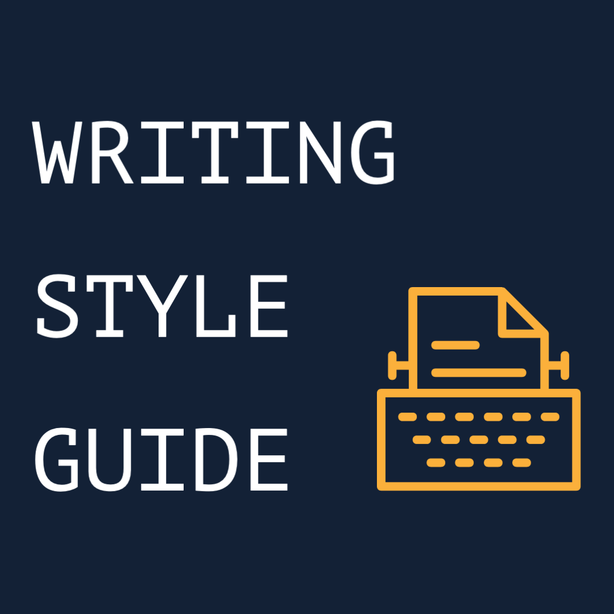

  

<h1 align="center">Writing Style Guide</h1>

  

  
  
  

This is a VSCode extension based on the [writing style guide from Microsoft](https://docs.microsoft.com/en-us/style-guide/welcome/). The Microsoft Writing Style Guide helps you with your writing style and using the correct terminology in your communications.

By using the extension, you will not have to keep the writing style guide website open. The extension will hint you which writing or terminology can be improved.

## What is supported

In the current version, the extension supports highlighting the words which you can find in the `A-Z word list and term collections`.

## Work in progress

This extension is still a work in progress.

> Originates from an idea by [Luise Freese](https://twitter.com/LuiseFreese)

  

