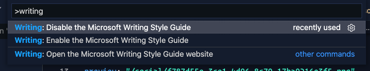

  

<h1 align="center">Writing Style Guide</h1>

  

  
  
  

This is a VSCode extension based on the [Microsoft Writing Style Guide](https://docs.microsoft.com/en-us/style-guide/welcome/), which helps you to get Microsoft's voice and style when you write about tech. Among other considerations about accessibility guidelines, bias-free communication and in-detail information on grammar, text formatting and capitalization, the guide points out an A-Z word list and term collection, which works as a refernce that can be looked up, when in doubt. 

When authoring a document in Visual Studio Code, you can now use this extension, which will hint you which word or terminology can be improved to match the recommendations from the Writung Style Guide. This means, that you do not need to have an external reference as an author, but can stay in the flow of your work as this extension gives you contextual information right where you need it. Now there is no need anymore to keep the Writing Style Guide website open or go back and forth, switching between writing and editing a document. 

If the extension detects a word listed in the **A-Z word list and term collections**, it shows blue squiggly underlines for the respecting word and displays a contextual popup, which explains the issue. It also links to respecting recommendation in the Writing Style Guide. 

## What is supported

In the current version, the extension supports highlighting the A-Z words which you can find in the `A-Z word list and term collections`.

## Commands

Currently the extension supports the following commands in VSCode:

- `Writing: Open the Microsoft Writing Style Guide website`
- `Writing: Enable the Microsoft Writing Style Guide` 
  - Extension is enabled by default. If you want to disable it for a project, you can run the disable command.
- `Writing: Disable the Microsoft Writing Style Guide`
  - Allows you to disable the extension for the current project. 

## Work in progress

This extension is still a work in progress.

> Originates from an idea by [Luise Freese](https://github.com/LuiseFreese)

  

